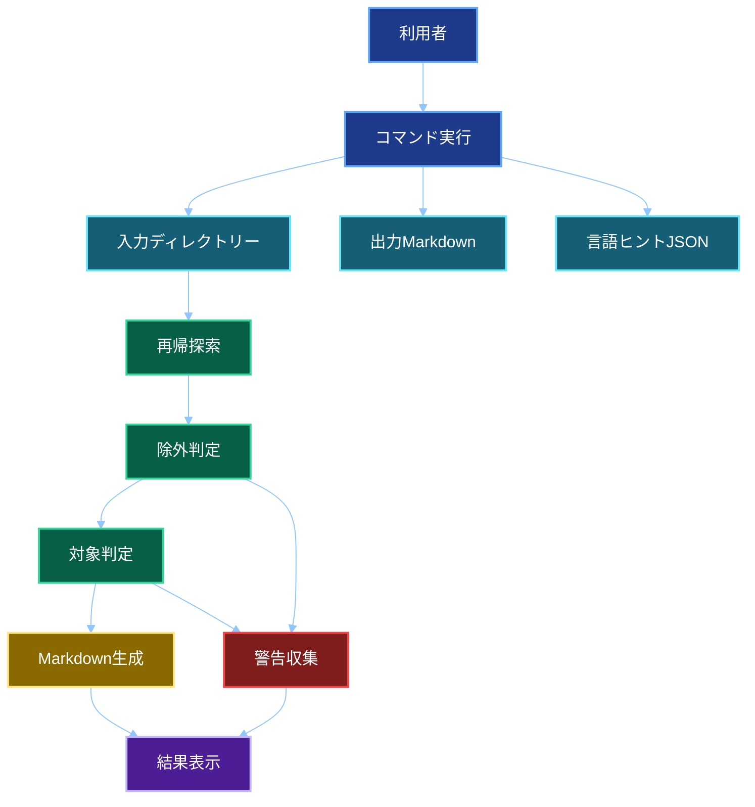

# 要件定義書

## 文書情報

| 項目 | 内容 |
| -- | -- |
| 文書名 | ソースコードMarkdown集約ツール 要件定義書 |
| 作成日 | 2026-05-27 |
| 作成者 | M365 Copilot |
| 想定実装 | .NET 10 コンソールアプリ |
| 開発環境 | Visual Studio Code |
| プロジェクト構成 | ソリューションなしの単一プロジェクト構成 |

## 目的

指定ディレクトリー配下のソースコードや設定ファイルを、M365 Copilotへ渡しやすい1つのMarkdownファイルへ集約する。
Zipアップロード非対応、または複数ファイルアップロードが手間な場面で利用する。

## 採用方針

- .NET 10コンソールアプリとして実装する。
- 開発はVisual StudioではなくVisual Studio Codeで行う。
- ソリューションファイルは作成せず、単一プロジェクト構成とする。
- macOS、Linux、Windowsを同一コードベースで対応する。
- `.gitignore`はGit互換ライブラリー方式を採用する。

## スコープ

### 対象範囲

- 入力ディレクトリー配下の再帰探索
- 隠しファイルと隠しディレクトリーの除外
- シンボリックリンクの非追跡
- `.gitignore`互換ライブラリーによる除外判定
- 言語ヒントJSONによる対象拡張子判定
- 対応文字コードの読み込み
- LF改行への正規化
- Markdown出力
- 警告と終了コードの出力
- Visual Studio Codeでの開発を前提としたプロジェクト構成

### 対象外

- 内容マスキング
- GUI
- dry run
- Markdownから元ファイルへの復元
- ソースコード解析
- Visual Studio固有機能への依存
- ソリューションファイルによる複数プロジェクト管理

## 動作環境要件

| 項目 | 要件 |
| -- | -- |
| macOS | 必須。Apple Siliconを主対象とする |
| Linux | 同一コードベースで対応する |
| Windows | 同一コードベースで同等機能を提供する |
| 実装方式 | .NET 10 コンソールアプリ |
| 開発環境 | Visual Studio Code |
| プロジェクト構成 | 単一プロジェクト。ソリューションファイルは作成しない |
| 配布方式 | OSおよびCPUアーキテクチャ別の単一実行ファイルを推奨 |

## 機能要件

### コマンド入力

| 項目 | 要件 |
| -- | -- |
| 入力ディレクトリー | 必須 |
| 出力Markdownファイル | 必須 |
| 言語ヒントJSON | 任意。未指定時は既定ファイルから読み込む |
| verbose | 任意 |
| force | 任意。既存ファイルを確認なしで上書き |
| help | 必須 |

### 探索要件

| 項目 | 要件 |
| -- | -- |
| 再帰探索 | する |
| 隠しファイル | 除外する |
| 隠しディレクトリー | 除外する |
| シンボリックリンク | 追跡しない。警告に記録する |
| 出力先ファイル | 自己取り込みしない |
| 出力順 | 相対パスのOrdinal昇順 |

### 除外要件

| 項目 | 要件 |
| -- | -- |
| `.gitignore` | Git互換ライブラリーで判定する |
| 既定除外 | `bin`、`obj`、`lib`、`node_modules`、`dist`、`build`、`.git` |
| 機密ファイル | `.gitignore`により除外されたものは出力対象外 |
| 将来拡張 | 除外判定は差し替え可能な構造にする |

### テキスト判定要件

| 項目 | 要件 |
| -- | -- |
| 判定方式 | 拡張子判定、バイナリー簡易判定、文字コード判定を組み合わせる |
| 対応文字コード | UTF-8、UTF-8 with BOM、Shift_JIS、UTF-16 LE |
| 判定不能 | スキップし、警告表示。Markdown作成は継続 |
| 最大ファイルサイズ | 50 MB per file |
| 改行コード | LFへ正規化 |
| 未知拡張子 | スキップし、警告表示。Markdown作成は継続 |

### Markdown要件

| 項目 | 要件 |
| -- | -- |
| 先頭タイトル | 入力引数をそのまま使用 |
| ファイルパス | 入力ディレクトリーからの相対パス |
| ファイル間区切り | `---`固定 |
| 言語ヒント | JSONで管理 |
| コードフェンス | 通常はバッククォート |
| フェンス衝突 | バッククォート衝突時はチルダへ切り替え |
| チルダ衝突 | 本文に存在しない長さのチルダを使用 |

### 出力Markdownファイル例

~~~markdown
# /path/to/source


`program/a.cs`

```csharp
# class A
```


---


`program/b.cs`

```csharp
# class B
```


---


`setting/c.json`

```json
"hogehoge"
```


---


`hoge.csproj`

```xml
<!-- hogehoge -->
```

~~~

### 言語ヒントJSON例

```json
[
	{
		"extension": "md",
		"fileType": "markdown"
	},
	{
		"extension": "cs",
		"fileType": "csharp"
	},
	{
		"extension": "csproj",
		"fileType": "xml"
	},
	{
		"extension": "json",
		"fileType": "json"
	}
]
```

## エラー処理要件

| 状況 | 処理 |
| -- | -- |
| 引数不足 | エラー表示して終了コード1 |
| 入力ディレクトリーなし | エラー表示して終了コード1 |
| 出力先ディレクトリーなし | 作成する |
| 出力先既存 | 通常は確認。force指定時は確認なしで上書き |
| 読み取り不可 | スキップして警告 |
| 未知拡張子 | スキップして警告 |
| 文字コード判定不能 | スキップして警告 |
| 致命的エラー | 終了コード2 |
| 一部スキップあり | Markdown作成後に終了コード3 |

## 終了コード

| コード | 意味 |
| --: | -- |
| 0 | 成功 |
| 1 | 引数エラー |
| 2 | 実行時エラー |
| 3 | 一部スキップまたは警告あり |

## 非機能要件

| 項目 | 要件 |
| -- | -- |
| 性能 | 小規模は数分程度、大規模は1時間以内を目標 |
| メモリ | 全ファイル内容を一括保持しない |
| 保守性 | 単一プロジェクト内でフォルダー分割し、探索、除外、判定、生成、警告を責務分離 |
| セキュリティ | `.gitignore`除外とシンボリックリンク非追跡を基本防御とする |
| 拡張性 | 将来のシークレット警告機能を追加しやすくする |

## 全体要件図



## 受け入れ条件

- Visual Studio Codeで開発でき、Visual Studio固有機能に依存しない。
- ソリューションファイルなしの単一プロジェクト構成で成立する。
- 対象ファイルが1つのMarkdownファイルへ出力される。
- 隠しファイルと隠しディレクトリーが除外される。
- `.gitignore`対象ファイルが除外される。
- 未知拡張子はスキップされ、終了コード3となる。
- コードフェンス衝突時もMarkdownが壊れない。
- 正常時は終了コード0となる。
