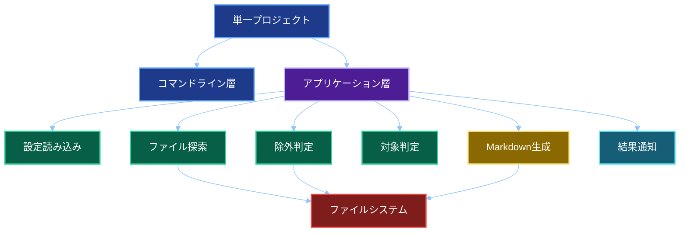
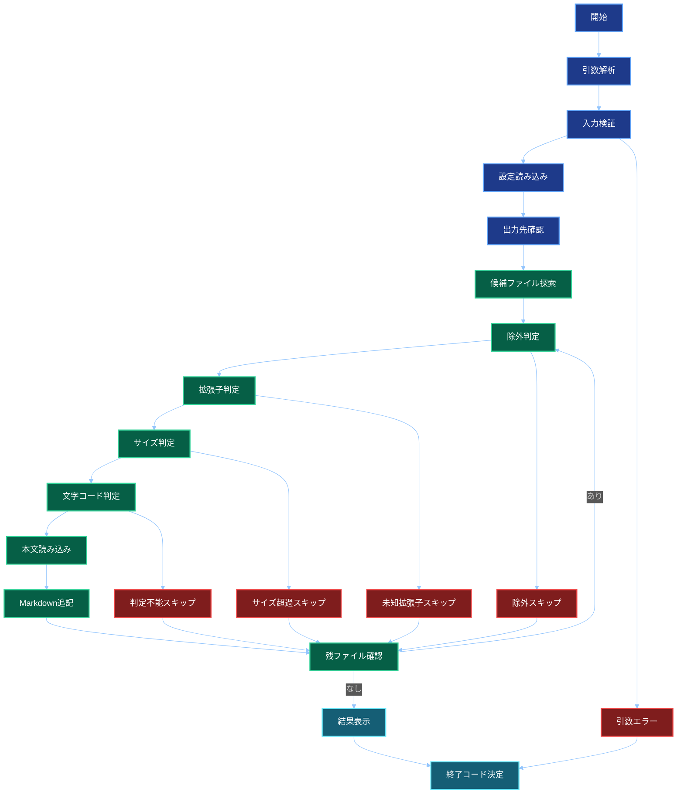
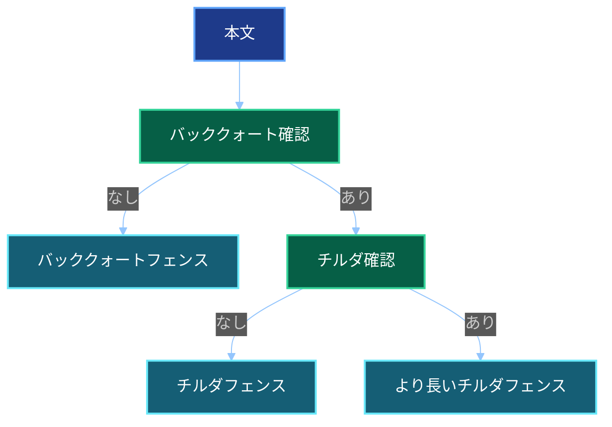

# 基本設計書

## 文書情報

| 項目 | 内容 |
| -- | -- |
| 文書名 | ソースコードMarkdown集約ツール 基本設計書 |
| 作成日 | 2026-05-27 |
| 作成者 | M365 Copilot |
| 想定実装 | .NET 10 コンソールアプリ |
| 開発環境 | Visual Studio Code |
| プロジェクト構成 | ソリューションなしの単一プロジェクト構成 |

## システム概要

本ツールは、入力ディレクトリーを再帰的に探索し、対象ファイルをMarkdownのコードブロックとして1ファイルに集約する。
除外判定は隠しパス、シンボリックリンク、既定除外ディレクトリー、Git互換ライブラリーによる`.gitignore`判定を組み合わせる。

## 開発構成

### 方針

- .NET 10のコンソールアプリとして作成する。
- Visual Studio Codeで開発する。
- `.sln`ファイルは作成しない。
- 単一の`.csproj`で構成する。
- 単一プロジェクト内でフォルダー分割し、責務を整理する。

### ディレクトリー構成案

```text
source-to-markdown
├── source-to-markdown.csproj
├── Program.cs
├── appsettings.language-map.json
├── Core
│   ├── Models
│   ├── Enums
│   ├── Interfaces
│   └── UseCases
├── Infrastructure
│   ├── FileSystem
│   ├── GitIgnore
│   ├── Encoding
│   └── Markdown
├── Cli
│   ├── Options
│   └── Output
└── Tests
```

補足として、`Tests`は単一プロジェクト方針を優先する場合は手動テスト資材置き場とする。
自動テストプロジェクトが必要になった場合のみ、将来別プロジェクト化を検討する。

## コマンド仕様

```bash
source-to-markdown <source-directory> <output-markdown> [options]
```

| オプション | 説明 |
| -- | -- |
| `--language-map <path>` | 拡張子と言語ヒントの対応JSONを指定 |
| `--verbose` | 詳細ログを表示 |
| `--force` | 確認なしで上書き |
| `--help` | ヘルプ表示 |

## 入出力

### 入力

- 入力ディレクトリー
- 出力Markdownファイル
- 言語ヒントJSON
- `.gitignore`
- コマンドラインオプション

### 出力

- Markdownファイル
- 標準出力の処理結果
- 標準エラー出力の警告とエラー
- 終了コード

## 全体構成



## コンポーネント設計

| コンポーネント | 配置案 | 役割 |
| -- | -- | -- |
| `Program` | ルート | エントリーポイント |
| `CommandLineParser` | `Cli/Options` | 引数解析 |
| `ConsoleResultWriter` | `Cli/Output` | 結果表示 |
| `AppSettingsLoader` | `Core/UseCases` | 設定読み込み |
| `FileCollector` | `Infrastructure/FileSystem` | 候補ファイル収集 |
| `IgnoreRuleEvaluator` | `Infrastructure/GitIgnore` | Git互換ライブラリーと既定除外による除外判定 |
| `LanguageHintMap` | `Core/Models` | 拡張子と言語ヒントの対応管理 |
| `TextFileDetector` | `Infrastructure/Encoding` | サイズ、バイナリー、文字コード判定 |
| `FileContentReader` | `Infrastructure/FileSystem` | 読み込みとLF正規化 |
| `MarkdownWriter` | `Infrastructure/Markdown` | Markdown生成 |
| `WarningCollector` | `Core/UseCases` | 警告集約 |
| `ExitCodeResolver` | `Core/UseCases` | 終了コード決定 |

## 処理フロー



## 除外判定設計

1. 出力先ファイル自身を除外する。
2. 隠しファイルと隠しディレクトリー配下を除外する。
3. シンボリックリンクを除外する。
4. 既定除外ディレクトリー配下を除外する。
5. Git互換ライブラリーで`.gitignore`対象を除外する。

## 文字コード設計

| 順序 | 判定 |
| --: | -- |
| 1 | BOM確認 |
| 2 | UTF-8 with BOM |
| 3 | UTF-16 LE BOM |
| 4 | BOMなしUTF-8厳格デコード |
| 5 | Shift_JIS厳格デコード |
| 6 | UTF-16 LE妥当性確認 |
| 7 | 判定不能としてスキップ |

## Markdown生成設計

1ファイル単位で、相対パス、空行、コードフェンス、本文、コードフェンス、区切り線を出力する。



## Visual Studio Code開発方針

- `dotnet build`、`dotnet run`、`dotnet publish`をターミナルから実行する。
- デバッグ設定は必要に応じて`.vscode/launch.json`で管理する。
- ビルドタスクは必要に応じて`.vscode/tasks.json`で管理する。
- Visual Studio固有の`.sln`管理、プロジェクト参照管理、GUI操作に依存しない。

## テスト設計概要

| 分類 | 内容 |
| -- | -- |
| 正常系 | `.cs`、`.json`、`.csproj`が出力される |
| ファイル除外 | 隠しファイル、既定除外、`.gitignore`対象が除外される |
| 未知拡張子 | スキップされ終了コード3となる |
| 文字コード | UTF-8、UTF-8 with BOM、Shift_JIS、UTF-16 LEを処理できる |
| フェンス衝突 | Markdown構造が壊れない |
