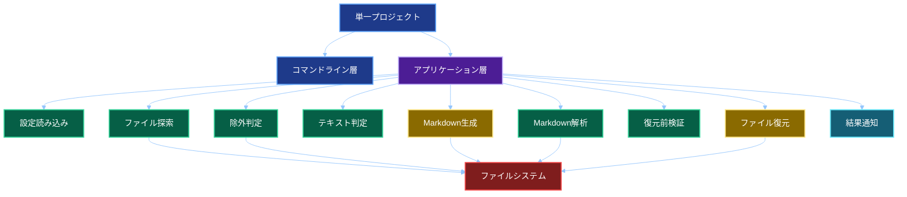
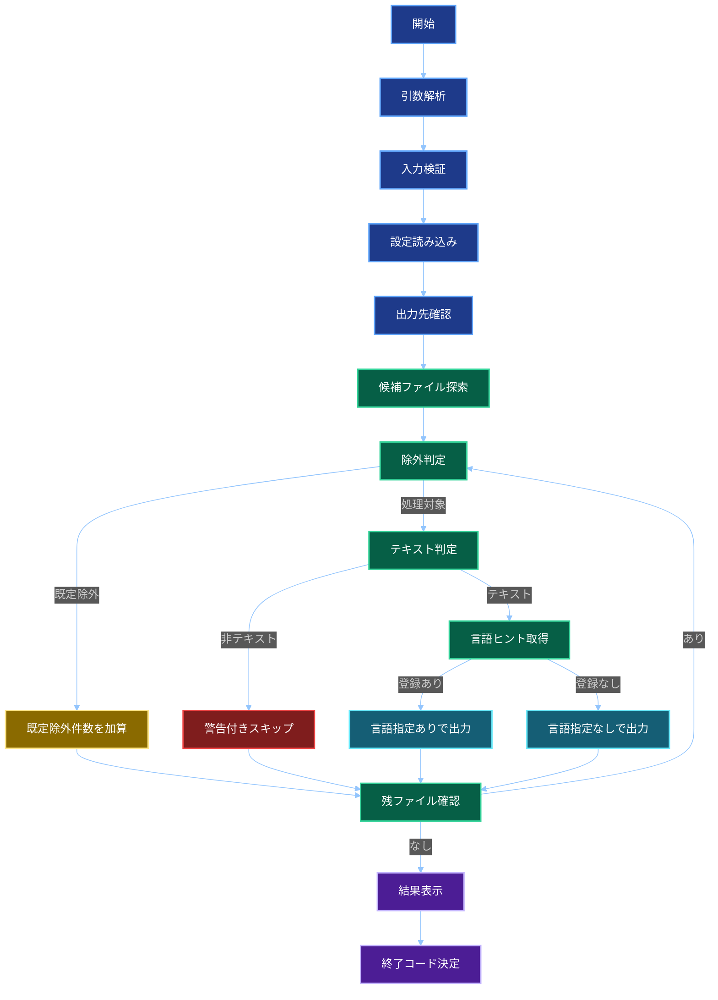
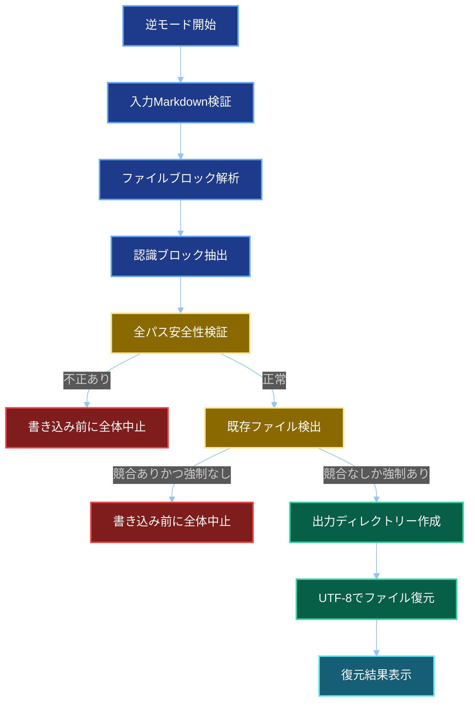
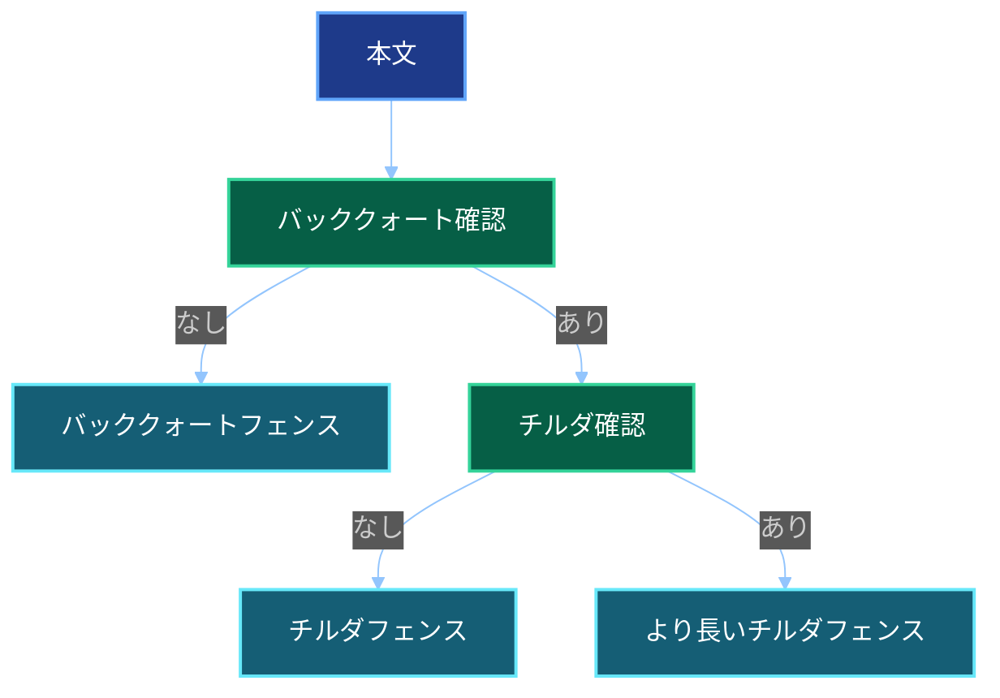

# 基本設計書

## 文書情報

| 項目 | 内容 |
| -- | -- |
| 文書名 | ソースコードMarkdown集約ツール 基本設計書 |
| 作成日 | 2026-05-27 |
| 更新日 | 2026-10-04 |
| 作成者 | M365 Copilot |
| 想定実装 | .NET 10 コンソールアプリ |
| 開発環境 | Visual Studio Code |
| プロジェクト構成 | ソリューションなしの単一プロジェクト構成 |

## システム概要

本ツールは、入力ディレクトリーを再帰的に探索し、対象ファイルをMarkdownのコードブロックとして1ファイルに集約する。
除外判定は隠しパス、シンボリックリンク、既定除外ディレクトリー、Git互換ライブラリーによる`.gitignore`判定を組み合わせる。
`--reverse`指定時は、本ツールが出力したMarkdownから認識可能なファイルブロックを抽出し、リポジトリーのディレクトリーを復元する。

## 開発構成

### 方針

- .NET 10のコンソールアプリとして作成する。
- Visual Studio Codeで開発する。
- `.sln`ファイルは作成しない。
- 単一の`.csproj`で構成する。
- 単一プロジェクト内でフォルダー分割し、責務を整理する。

### ディレクトリー構成案

```text
source-to-markdown
├── source-to-markdown.csproj
├── Program.cs
├── appsettings.language-map.json
├── Core
│   ├── Models
│   ├── Enums
│   ├── Interfaces
│   └── UseCases
├── Infrastructure
│   ├── FileSystem
│   ├── GitIgnore
│   ├── Encoding
│   └── Markdown
├── Cli
│   ├── Options
│   └── Output
└── Tests
```

## コマンド仕様

通常モード（ディレクトリー → Markdown）：

```bash
source-to-markdown <source-directory> <output-markdown> [options]
```

逆モード（Markdown → ディレクトリー）：

```bash
source-to-markdown <input-markdown> <output-directory> --reverse [options]
```

| オプション | 説明 |
| -- | -- |
| `--reverse` | Markdownからリポジトリーのディレクトリーを復元 |
| `--language-map <path>` | 拡張子と言語ヒントの対応JSONを指定。逆モードでは指定不可 |
| `--verbose` | 詳細ログを表示 |
| `--force` | 確認なしで上書き |
| `--help` | ヘルプ表示 |

## 入出力

### 入力

- 通常モードの入力ディレクトリー
- 逆モードの入力Markdownファイル
- 出力パス
- 言語ヒントJSON
- `.gitignore`
- コマンドラインオプション

### 出力

- 通常モードのMarkdownファイル
- 逆モードの復元ディレクトリー
- 標準出力の処理結果
- 標準エラー出力の警告とエラー
- 終了コード

## 全体構成



## コンポーネント設計

| コンポーネント | 配置案 | 役割 |
| -- | -- | -- |
| `Program` | ルート | エントリーポイントとモード分岐 |
| `CommandLineParser` | `Cli/Options` | 引数解析 |
| `ConsoleResultWriter` | `Cli/Output` | 結果表示 |
| `AppSettingsLoader` | `Core/UseCases` | 設定読み込み |
| `FileCollector` | `Infrastructure/FileSystem` | 候補ファイル収集 |
| `IgnoreRuleEvaluator` | `Infrastructure/GitIgnore` | 除外判定 |
| `LanguageHintMap` | `Core/Models` | 拡張子と言語ヒントの対応管理 |
| `TextFileDetector` | `Infrastructure/Encoding` | サイズ、バイナリー、文字コード判定 |
| `FileContentReader` | `Infrastructure/FileSystem` | 読み込みとLine Feed正規化 |
| `MarkdownWriter` | `Infrastructure/Markdown` | Markdown生成 |
| `MarkdownRepositoryParser` | `Infrastructure/Markdown` | ファイルブロック抽出 |
| `SourceToMarkdownUseCase` | `Core/UseCases` | 通常モードの制御 |
| `MarkdownToSourceUseCase` | `Core/UseCases` | 逆モードの検証と復元 |
| `WarningCollector` | `Core/UseCases` | 警告集約 |
| `ExitCodeResolver` | `Core/UseCases` | 終了コード決定 |

## 処理フロー

### 通常モード



### 逆モード



## 除外判定設計

1. 出力先ファイル自身を除外する。
2. 隠しファイルと隠しディレクトリー配下を除外する。
3. シンボリックリンクを除外する。
4. 既定除外ディレクトリー配下を除外する。
5. Git互換ライブラリーで`.gitignore`対象を除外する。
6. 既定除外はファイルごとの警告に追加せず、件数だけを集計する。

## 文字コード設計

| 順序 | 判定 |
| --: | -- |
| 1 | Byte Order Mark確認 |
| 2 | UTF-8 with BOM |
| 3 | UTF-16 Little Endian with BOM |
| 4 | Byte Order MarkなしUTF-8厳格デコード |
| 5 | Shift-JIS厳格デコード |
| 6 | UTF-16 Little Endian妥当性確認 |
| 7 | 判定不能としてスキップ |

言語ヒントJSONに拡張子が登録されているかどうかは、テキスト判定の採否に使用しない。

## Markdown生成設計

1ファイル単位で、相対パス、空行、コードフェンス、本文、コードフェンス、区切り線を出力する。
言語ヒントが未登録の場合は、コードフェンスの後ろへファイル種別を付与しない。



## Markdown復元設計

- 単独行のバッククォートで囲まれた相対パスの後ろに、バッククォートまたはチルダのコードフェンスがある構造を認識する。
- 認識できない見出し、説明文、水平区切り、コードブロックは無視する。
- Markdownに記載されたファイル名と拡張子をそのまま使用する。
- 解析、全件検証、全件書き込みの順で処理する。
- 復元ファイルはUTF-8、Byte Order Markなし、Line Feedとする。

## Visual Studio Code開発方針

- `dotnet build`、`dotnet run`、`dotnet publish`をターミナルから実行する。
- デバッグ設定は必要に応じて`.vscode/launch.json`で管理する。
- ビルドタスクは必要に応じて`.vscode/tasks.json`で管理する。
- Visual Studio固有の`.sln`管理、プロジェクト参照管理、Graphical User Interface操作に依存しない。

## テスト設計概要

| 分類 | 内容 |
| -- | -- |
| 正常系 | `.cs`、`.json`、`.csproj`が出力される |
| ファイル除外 | 隠しファイル、既定除外、`.gitignore`対象が除外される |
| 言語ヒント未登録 | 対応文字コードのテキストとして言語ヒントなしで出力される |
| 既定除外 | 個別警告なし、件数表示、既定除外だけなら終了コード0となる |
| 文字コード | UTF-8、UTF-8 with Byte Order Mark、Shift-JIS、UTF-16 Little Endianを処理できる |
| フェンス衝突 | Markdown構造が壊れない |
| 逆モード | 認識可能なファイルブロックを復元できる |
| 復元安全性 | 不正パスや既存ファイル競合がある場合は書き込み前に全体を中止する |
