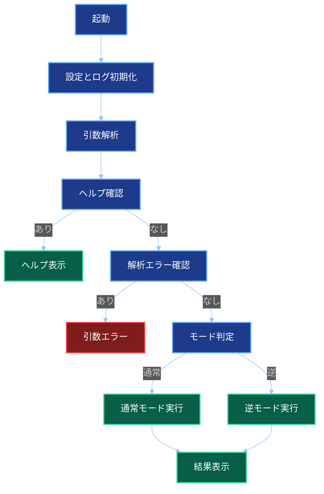
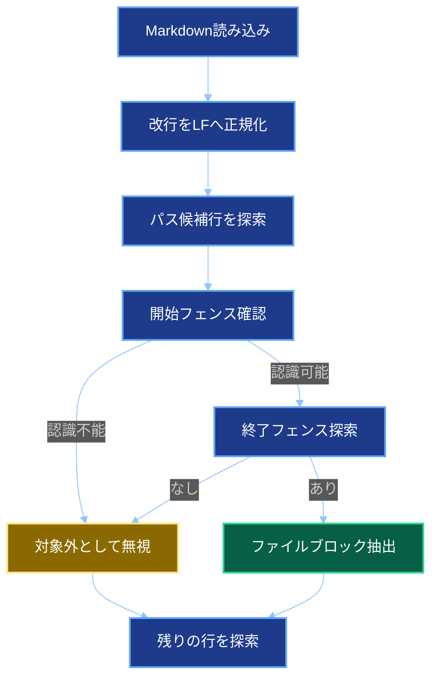
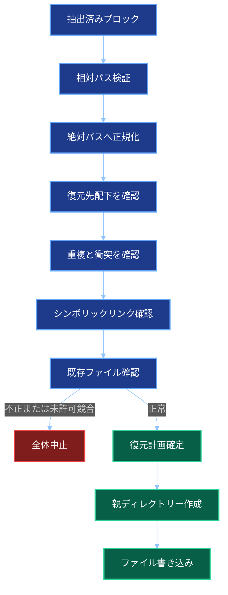
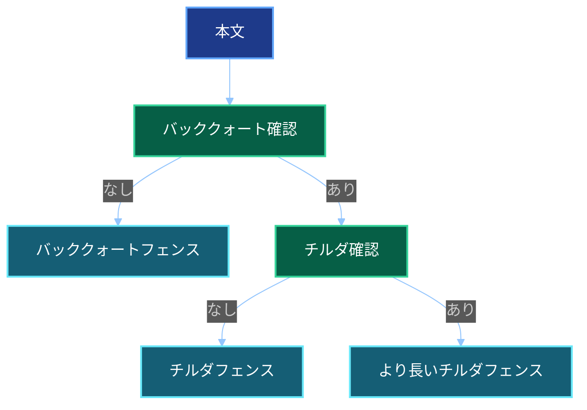

# 詳細設計書

## 文書情報

| 項目 | 内容 |
| -- | -- |
| 文書名 | ソースコードMarkdown集約ツール 詳細設計書 |
| 作成日 | 2026-05-27 |
| 更新日 | 2026-10-04 |
| 作成者 | M365 Copilot |
| 想定実装 | .NET 10 コンソールアプリ |
| 開発環境 | Visual Studio Code |
| プロジェクト構成 | ソリューションなしの単一プロジェクト構成 |

## プロジェクト構成

```text
source-to-markdown
├── source-to-markdown.csproj
├── Program.cs
├── appsettings.language-map.json
├── Cli
│   ├── Options
│   └── Output
├── Core
│   ├── Enums
│   ├── Interfaces
│   ├── Models
│   └── UseCases
├── Infrastructure
│   ├── Encoding
│   ├── FileSystem
│   ├── GitIgnore
│   └── Markdown
├── Tests
└── .vscode
    ├── launch.json
    └── tasks.json
```

## `.csproj`方針

- Target Frameworkは`net10.0`とする。
- OutputTypeは`Exe`とする。
- Nullableを有効化する。
- ImplicitUsingsを有効化する。
- Git互換ignoreライブラリーなど外部依存はPackageReferenceで追加する。

## 名前空間

| 名前空間 | 役割 |
| -- | -- |
| `SourceToMarkdown.Cli` | 起動、引数解析、結果表示 |
| `SourceToMarkdown.Core` | ユースケース、モデル、インターフェイス |
| `SourceToMarkdown.Infrastructure` | ファイルシステム、Git ignore、文字コード処理、Markdown生成と解析 |

## 主要モデル

### `CommandLineOptions`

| プロパティ | 型 | 説明 |
| -- | -- | -- |
| `InputPath` | `string` | 通常モードでは入力ディレクトリー、逆モードでは入力Markdownファイル |
| `OutputPath` | `string` | 通常モードでは出力Markdown、逆モードでは復元先ディレクトリー |
| `LanguageMapPath` | `string?` | 言語ヒントJSON |
| `Verbose` | `bool` | 詳細表示 |
| `Force` | `bool` | 強制上書き |
| `Reverse` | `bool` | 逆モード |
| `ShowHelp` | `bool` | ヘルプ表示 |
| `ParseErrorMessage` | `string?` | 引数解析エラー |

### `ProcessingResult`

| プロパティ | 型 | 説明 |
| -- | -- | -- |
| `WrittenFileCount` | `int` | 出力ファイル数 |
| `SkippedFileCount` | `int` | スキップファイル数 |
| `DefaultExcludedFileCount` | `int` | 既定除外ファイル数 |
| `Warnings` | `IReadOnlyList<ProcessingWarning>` | 既定除外を含まない警告一覧 |
| `ExitCode` | `ExitCode` | 終了コード |

### `MarkdownFileBlock`

| プロパティ | 型 | 説明 |
| -- | -- | -- |
| `RelativePath` | `string` | Markdownに記載された相対パス |
| `Content` | `string` | 復元するファイル本文 |

### `MarkdownToSourceResult`

| プロパティ | 型 | 説明 |
| -- | -- | -- |
| `RestoredFileCount` | `int` | 復元ファイル数 |
| `ExitCode` | `ExitCode` | 終了コード |

## インターフェイス

### `ILanguageHintMap`

```csharp
bool TryGetFileType(string filePath, out string fileType);
```

言語ヒントを取得できない場合でも、呼び出し側は対象ファイルをスキップせず、空の言語ヒントで出力する。

### `IMarkdownWriter`

```csharp
void WriteHeader(string sourceDirectoryArgument);
void WriteFileBlock(string relativePath, string fileType, string content);
```

`fileType`には空文字を許容し、その場合は言語指定なしのコードフェンスを出力する。

### `IMarkdownRepositoryParser`

```csharp
IReadOnlyList<MarkdownFileBlock> Parse(string markdownPath);
```

本ツール形式として認識可能なファイルブロックを抽出し、認識できないMarkdown部分を無視する。

## 列挙型

### `ExitCode`

| 値 | 数値 | 説明 |
| -- | --: | -- |
| `Success` | 0 | 成功。既定除外だけが発生した場合を含む |
| `ArgumentError` | 1 | 引数エラー |
| `RuntimeError` | 2 | 実行時エラー |
| `PartialSkipped` | 3 | 既定除外以外の一部スキップまたは警告あり |

### `WarningType`

| 値 | 説明 |
| -- | -- |
| `SkippedByIgnoreRule` | ignoreルールによる除外 |
| `SkippedHiddenPath` | 隠しパスによる除外 |
| `SkippedSymbolicLink` | シンボリックリンクによる除外 |
| `SkippedDefaultExcludedDirectory` | 警告一覧には追加せず件数として集計する既定除外 |
| `SkippedUnknownExtension` | 互換性維持用。通常処理では使用しない |
| `SkippedTooLarge` | サイズ超過による除外 |
| `SkippedUnreadable` | 読み取り不可による除外 |
| `SkippedEncodingUnknown` | 文字コード判定不能による除外 |

## 起動処理



1. アプリケーション設定とログを初期化する。
2. コマンドライン引数を解析する。
3. ヘルプまたは引数解析エラーを処理する。
4. `Reverse`の値で通常モードと逆モードへ分岐する。
5. モードに対応する入力と出力を検証する。

逆モードで`--language-map`が指定された場合は引数エラーとする。

## 通常モード処理詳細

1. 候補ファイルを列挙する。
2. 除外判定を行う。
3. 既定除外の場合は`SkippedFileCount`と`DefaultExcludedFileCount`を加算し、`WarningCollector`には追加しない。
4. サイズ、バイナリー、文字コードを判定する。
5. 言語ヒントを取得する。
6. 言語ヒント未登録の場合は空文字を使用する。
7. 本文をLine Feedへ正規化し、Markdownへ出力する。
8. 既定除外以外の警告有無で終了コードを決定する。

## Markdown復元処理詳細

### Markdown解析



1. 入力MarkdownをUTF-8として読み込み、改行をLine Feedへ正規化する。
2. 単独行のバッククォート囲みを相対パス候補とする。
3. パス候補の後ろにある空行を読み飛ばす。
4. 3文字以上のバッククォートまたはチルダの開始フェンスを認識する。
5. 開始フェンスと同じ文字列の終了フェンスまでを本文とする。
6. 認識条件を満たさないMarkdown部分は無視する。

### 復元前検証



1. 相対パスが空でないことを確認する。
2. 絶対パスでないことを確認する。
3. パス区切りを実行環境へ合わせて正規化する。
4. 復元先と結合して絶対パスへ正規化する。
5. 復元先ディレクトリー配下であることを確認する。
6. 正規化後のパス重複を確認する。
7. 既存の親ディレクトリーがシンボリックリンクでないことを確認する。
8. ファイルとディレクトリーのパス衝突を確認する。
9. 既存ファイルを全件検出する。
10. 不正または`--force`なしの競合が1件でもあれば、書き込み前に処理全体を中止する。

Windowsではパスの大文字小文字を区別せず、macOSとLinuxでは区別して重複を判定する。

### ファイル復元

- Markdownに記載された相対パスとファイル名を使用する。
- 言語ヒントなしでも拡張子を追加または変更しない。
- 親ディレクトリーを作成する。
- UTF-8、Byte Order Markなしで書き込む。
- 改行コードはLine Feedとする。
- `--verbose`指定時は復元した相対パスを表示する。

## 文字コード判定詳細

1. ファイルサイズが50 MB以下か確認する。
2. Byte Order Markを確認する。
3. UTF-8 with BOMを判定する。
4. UTF-16 Little Endian with BOMを判定する。
5. Byte Order MarkなしUTF-8を厳格デコードで確認する。
6. Shift-JISを厳格デコードで確認する。
7. UTF-16 Little Endianの妥当性を確認する。
8. 不明ならスキップする。

空ファイルはUTF-8、Byte Order Markなしのテキストとして扱う。

## Markdownフェンス詳細



1. 本文に3連バッククォートがなければ3連バッククォートを使う。
2. 本文に3連バッククォートがあれば3連チルダを使う。
3. 3連チルダも含まれる場合は4連以上のチルダを順に試す。
4. 本文に存在しない長さのチルダを採用する。
5. 言語ヒント未登録の場合はフェンスの後ろに文字列を付けない。

## 出力先制御

### 通常モード

- 出力先ディレクトリーが存在しない場合は作成する。
- `--force`ありの場合は既存ファイルを上書きする。
- `--force`なしの場合は確認する。

### 逆モード

- 書き込み前に復元対象を全件検証する。
- `--force`ありの場合は既存ファイルを上書きする。
- `--force`なしで既存ファイルが1件でもある場合は処理全体を中断する。

## ログ設計

### 標準出力

- 処理完了
- 出力パス
- 出力または復元ファイル数
- スキップファイル数
- 既定除外ファイル数

### 標準エラー出力

- 既定除外以外の警告一覧
- エラー詳細

### verbose時

- 処理中ファイル
- スキップ理由
- 復元ファイル

## テスト詳細

| ID | 分類 | 内容 | 期待結果 |
| -- | -- | -- | -- |
| T001 | 正常系 | `.cs`と`.json`を含む | Markdown生成、終了コード0 |
| T002 | 正常系 | Shift-JISを含む | 正しく出力 |
| T003 | 正常系 | UTF-16 Little Endianを含む | 正しく出力 |
| T004 | 正常系 | 未登録拡張子または拡張子なしのテキストを含む | 言語ヒントなしで出力 |
| T005 | 正常系 | 空ファイルを含む | 出力される |
| T103 | 除外 | `bin`配下を含む | 個別警告なし、件数表示、既定除外だけなら終了コード0 |
| T501 | 逆モード | 認識可能な複数ブロックを含む | 指定ディレクトリーへ復元 |
| T502 | 逆モード | 言語ヒントなしブロックを含む | Markdown記載のファイル名で復元 |
| T503 | 逆モード | 無関係なMarkdownを含む | 無視して認識可能なブロックだけ復元 |
| T504 | 逆モード | 復元先外のパスを含む | 書き込み前に処理全体を中止 |
| T505 | 逆モード | 重複またはパス衝突を含む | 書き込み前に処理全体を中止 |
| T506 | 逆モード | 既存ファイルがありforceなし | 書き込み前に処理全体を中止 |
| T507 | 逆モード | 既存ファイルがありforceあり | 上書き成功 |

## 将来拡張

| 拡張 | 方針 |
| -- | -- |
| シークレット警告 | `ISecretScanner`を追加 |
| 最大サイズ変更 | `--max-file-size`を追加 |
| シンボリックリンク追跡 | `--follow-symlinks`を追加 |
| dry run | 対象一覧と警告だけ表示 |

## 実装上の注意

- 通常モードでは全ファイル本文を一括保持しない。
- 出力順保証のためファイルパス一覧は先に収集する。
- Shift-JIS利用時は必要に応じてコードページプロバイダーを登録する。
- Markdown上の相対パスは`/`へ正規化する。
- 逆モードは、解析と全件検証が完了するまでファイルを書き込まない。
- Markdownには元の文字コード、Byte Order Mark、ファイル末尾改行の有無、ファイル属性、実行権限が保持されない。
- 単一プロジェクト構成を維持するため、フォルダーと名前空間で責務を分ける。
- Visual Studio固有の設定ファイルや操作に依存しない。
