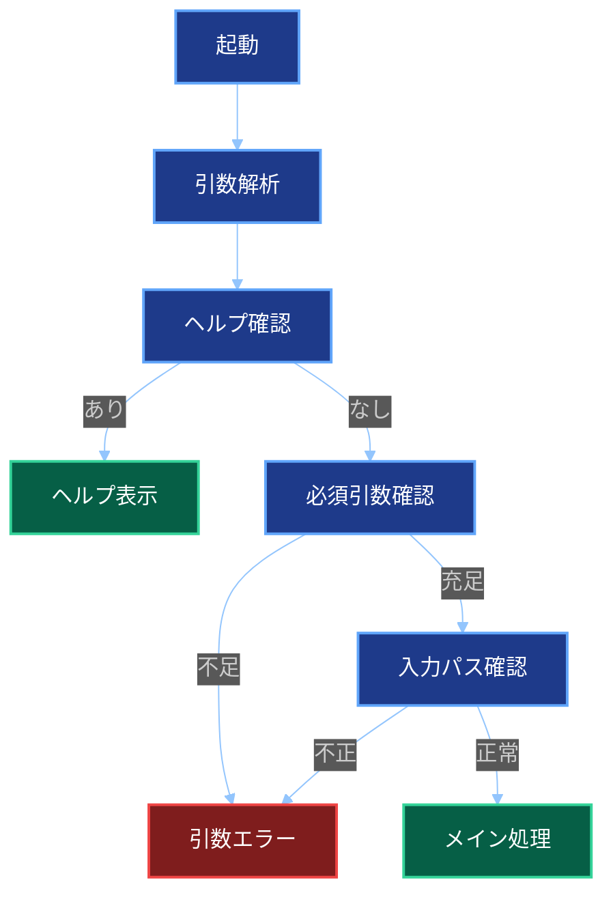

# 詳細設計書

## 文書情報

| 項目 | 内容 |
| -- | -- |
| 文書名 | ソースコードMarkdown集約ツール 詳細設計書 |
| 作成日 | 2026-05-27 |
| 作成者 | M365 Copilot |
| 想定実装 | .NET 10 コンソールアプリ |
| 開発環境 | Visual Studio Code |
| プロジェクト構成 | ソリューションなしの単一プロジェクト構成 |

## プロジェクト構成

```text
source-to-markdown
├── source-to-markdown.csproj
├── Program.cs
├── appsettings.language-map.json
├── Cli
│   ├── Options
│   └── Output
├── Core
│   ├── Enums
│   ├── Interfaces
│   ├── Models
│   └── UseCases
├── Infrastructure
│   ├── Encoding
│   ├── FileSystem
│   ├── GitIgnore
│   └── Markdown
├── Tests
└── .vscode
    ├── launch.json
    └── tasks.json
```

## `.csproj`方針

- Target Frameworkは`net10.0`とする。
- OutputTypeは`Exe`とする。
- Nullableを有効化する。
- ImplicitUsingsを有効化する。
- 単一プロジェクトのため、ProjectReferenceは使用しない。
- Git互換ignoreライブラリーなど外部依存はPackageReferenceで追加する。

## 名前空間

| 名前空間 | 役割 |
| -- | -- |
| `SourceToMarkdown.Cli` | 起動、引数解析、結果表示 |
| `SourceToMarkdown.Core` | ユースケース、モデル、インターフェイス |
| `SourceToMarkdown.Infrastructure` | ファイルシステム、Git ignore、文字コード処理 |

## 主要モデル

### `CommandLineOptions`

| プロパティ | 型 | 説明 |
| -- | -- | -- |
| `SourceDirectoryPath` | `string` | 入力ディレクトリー |
| `OutputMarkdownPath` | `string` | 出力Markdown |
| `LanguageMapPath` | `string?` | 言語ヒントJSON |
| `Verbose` | `bool` | 詳細表示 |
| `Force` | `bool` | 強制上書き |
| `ShowHelp` | `bool` | ヘルプ表示 |

### `ProcessingWarning`

| プロパティ | 型 | 説明 |
| -- | -- | -- |
| `WarningType` | `WarningType` | 警告種別 |
| `Path` | `string` | 対象パス |
| `Message` | `string` | メッセージ |
| `ExceptionMessage` | `string?` | 例外メッセージ |

### `ProcessingResult`

| プロパティ | 型 | 説明 |
| -- | -- | -- |
| `WrittenFileCount` | `int` | 出力ファイル数 |
| `SkippedFileCount` | `int` | スキップファイル数 |
| `Warnings` | `IReadOnlyList<ProcessingWarning>` | 警告一覧 |
| `ExitCode` | `ExitCode` | 終了コード |

## インターフェイス

### `IFileCollector`

```csharp
IEnumerable<FileCandidate> Collect(string sourceDirectoryPath, string outputMarkdownPath);
```

責務:

- 候補ファイルを再帰列挙する。
- 隠しパス、シンボリックリンク、出力先自身を除外する。
- 相対パスのOrdinal昇順に並べる。

### `IIgnoreRuleEvaluator`

```csharp
IgnoreDecision Evaluate(string sourceDirectoryPath, string relativePath);
```

責務:

- Git互換ライブラリーで`.gitignore`判定を行う。
- 既定除外ディレクトリーを判定する。
- 除外理由を返す。

### `ILanguageHintMap`

```csharp
bool TryGetFileType(string filePath, out string fileType);
```

### `ITextFileDetector`

```csharp
TextDetectionResult Detect(string filePath, long maxFileSizeBytes);
```

### `IFileContentReader`

```csharp
string ReadAllTextNormalized(string filePath, Encoding encoding);
```

### `IMarkdownWriter`

```csharp
void WriteHeader(string sourceDirectoryArgument);
void WriteFileBlock(string relativePath, string fileType, string content);
```

## 列挙型

### `ExitCode`

| 値 | 数値 | 説明 |
| -- | --: | -- |
| `Success` | 0 | 成功 |
| `ArgumentError` | 1 | 引数エラー |
| `RuntimeError` | 2 | 実行時エラー |
| `PartialSkipped` | 3 | 一部スキップまたは警告あり |

### `WarningType`

| 値 | 説明 |
| -- | -- |
| `SkippedByIgnoreRule` | ignoreルールによる除外 |
| `SkippedHiddenPath` | 隠しパスによる除外 |
| `SkippedSymbolicLink` | シンボリックリンクによる除外 |
| `SkippedDefaultExcludedDirectory` | 既定除外ディレクトリーによる除外 |
| `SkippedUnknownExtension` | 未知拡張子による除外 |
| `SkippedTooLarge` | サイズ超過による除外 |
| `SkippedUnreadable` | 読み取り不可による除外 |
| `SkippedEncodingUnknown` | 文字コード判定不能による除外 |

## 起動処理



## `.gitignore`処理詳細

- Git互換ライブラリーを利用する。
- ライブラリー依存は`Infrastructure/GitIgnore/GitIgnoreRuleEvaluator`へ閉じ込める。
- `.gitignore`がない場合は既定除外のみ適用する。
- 複数階層の`.gitignore`を扱えるライブラリーを優先する。
- 具体的なライブラリーは実装開始時にメンテナンス状況、ライセンス、.NET 10対応状況を確認して決定する。

## 文字コード判定詳細

1. ファイルサイズが50 MB以下か確認する。
2. BOMを確認する。
3. UTF-8 with BOMを判定する。
4. UTF-16 LE BOMを判定する。
5. BOMなしUTF-8を厳格デコードで確認する。
6. Shift_JISを厳格デコードで確認する。
7. UTF-16 LEの妥当性を確認する。
8. 不明ならスキップする。

## Markdownフェンス詳細

1. 本文に3連バッククォートがなければ3連バッククォートを使う。
2. 本文に3連バッククォートがあれば3連チルダを使う。
3. 3連チルダも含まれる場合は4連以上のチルダを順に試す。
4. 本文に存在しない長さのチルダを採用する。

## 出力先制御

- 出力先ディレクトリーが存在しない場合は作成する。
- `--force`ありの場合は既存ファイルを上書きする。
- `--force`なしの場合は確認する。
- 確認で拒否された場合は処理を中断する。

## Visual Studio Code設定方針

### `launch.json`

- デバッグ対象は単一プロジェクトの出力DLLまたは実行ファイルとする。
- デバッグ引数に入力ディレクトリーと出力Markdownを設定できるようにする。

### `tasks.json`

- `dotnet build`タスクを定義する。
- 必要に応じて`dotnet publish`タスクを定義する。
- ソリューションではなく`.csproj`を対象にする。

## ログ設計

### 標準出力

- 処理開始
- 処理完了
- 出力ファイルパス
- 出力ファイル数
- スキップファイル数

### 標準エラー出力

- 警告一覧
- エラー詳細

### verbose時

- 処理中ファイル
- スキップ理由
- 採用文字コード
- 採用言語ヒント

## テスト詳細

| ID | 分類 | 内容 | 期待結果 |
| -- | -- | -- | -- |
| T001 | 正常系 | `.cs`と`.json`を含む | Markdown生成、終了コード0 |
| T002 | 正常系 | Shift_JISを含む | 正しく出力 |
| T003 | 正常系 | UTF-16 LEを含む | 正しく出力 |
| T101 | 除外 | 隠しファイルを含む | 出力されない |
| T102 | 除外 | `.gitignore`対象を含む | 出力されない |
| T103 | 除外 | `bin`配下を含む | 出力されない |
| T104 | 除外 | シンボリックリンクを含む | 警告、出力されない |
| T201 | 異常 | 未知拡張子を含む | 警告、終了コード3 |
| T202 | 異常 | 読み取り不可を含む | 警告、終了コード3 |
| T203 | 異常 | 50 MB超過を含む | 警告、終了コード3 |
| T301 | Markdown | 本文にフェンスを含む | Markdownが壊れない |
| T401 | 開発構成 | `.sln`なしで`dotnet build` | ビルド成功 |
| T402 | 開発構成 | VSCodeタスクからビルド | ビルド成功 |

## 将来拡張

| 拡張 | 方針 |
| -- | -- |
| シークレット警告 | `ISecretScanner`を追加 |
| 最大サイズ変更 | `--max-file-size`を追加 |
| シンボリックリンク追跡 | `--follow-symlinks`を追加 |
| dry run | 対象一覧と警告だけ表示 |
| 自動テスト分離 | 必要になった場合のみテストプロジェクトを追加 |

## 実装上の注意

- 全ファイル本文を一括保持しない。
- 出力順保証のためファイルパス一覧は先に収集する。
- Shift_JIS利用時は必要に応じてコードページプロバイダーを登録する。
- Markdown上の相対パスは`/`へ正規化する。
- 例外は警告または実行時エラーとして集約する。
- 単一プロジェクト構成を維持するため、フォルダーと名前空間で責務を分ける。
- Visual Studio固有の設定ファイルや操作に依存しない。
